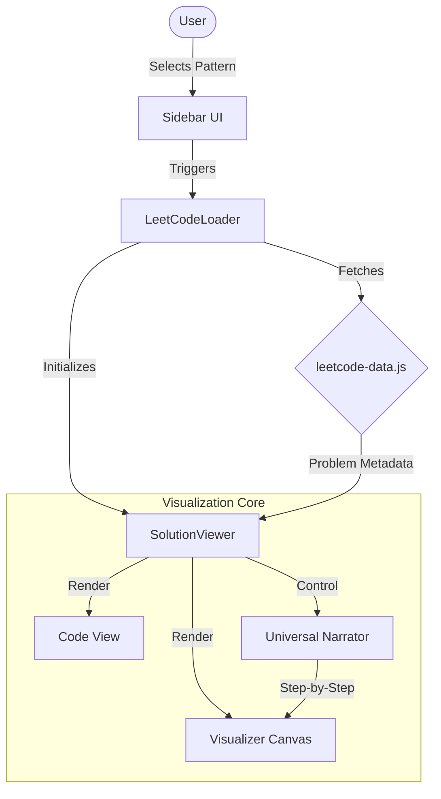

# 📚 DSA Study Sanctuary


**DSA Study Sanctuary** is an interactive, visually immersive platform designed to help students and developers master Data Structures and Algorithms. Unlike static textbooks, this project brings algorithms to life through dynamic visualizations, audio sonification, and step-by-step narrative breakdowns.

## 🚀 Features

-   **⚡ Interactive Visualizations**: Real-time sorting, searching, and pathfinding visualizations.
-   **🧠 LeetCode Patterns**: **[NEW]** Master common coding interview patterns (e.g., Arrays & Hashing, Sliding Window) with deep-dive visual walkthroughs.
-   **🎓 E-Lectures**: Integrated learning modules explaining core concepts.
-   **🔊 Audio Sonification**: Hear the algorithms! Sorting and graph traversals generate unique soundscapes.
-   **💾 Code Sandbox**: Experiment with algorithms in a live coding environment.
-   **📱 Responsive Design**: Fully optimized for desktop and mobile learning.

## 🛠️ Technology Stack

-   **Frontend**: Vanilla JavaScript (ES Modules), CSS3 (Variables, Flexbox/Grid)
-   **Build Tool**: [Vite](https://vitejs.dev/) - Blazing fast build tool.
-   **Styling**: Custom CSS with a modular architecture.

## 🏗️ Architecture



## 🏁 Getting Started

Follow these steps to set up the project locally:

### Prerequisites

-   Node.js (v14 or higher)
-   npm (v6 or higher)

### Installation

1.  **Clone the repository**
    ```bash
    git clone https://github.com/yourusername/sust-algo.git
    cd sust-algo
    ```

2.  **Install dependencies**
    ```bash
    npm install
    ```

3.  **Run the development server**
    ```bash
    npm run dev
    ```

4.  **Open in Browser**
    Visit `http://localhost:5173` to start learning!


## 📋 Specifications

| Feature | Details |
| :--- | :--- |
| **Supported Languages** | C++, Java, Python, JavaScript |
| **Visualization Engines** | Canvas API (Sorting), SVG (Graphs/Trees), DOM Grid (Matrices) |
| **Audio Engine** | Web Audio API based Sonification |
| **Data Source** | Local `LeetCode_Patterns` directory & Custom JSON |
| **State Management** | Vanilla JS Event-Driven Architecture |

## 🔮 Upcoming Features

-   [ ] **Expanded Pattern Library**: Sliding Window, Two Pointers, and Dynamic Programming patterns.
-   [ ] **User Accounts**: Track your progress and solved problems.
-   [ ] **Code Execution**: Integrated compiler to run your own code against test cases.
-   [ ] **Social Sharing**: Share your visualization replays with friends.
-   [ ] **Dark/Light Mode**: Full system-wide theme support.

## 🤝 Contributing

Contributions are what make the open-source community such an amazing place to learn, inspire, and create. Any contributions you make are **greatly appreciated**.

1.  Fork the Project
2.  Create your Feature Branch (`git checkout -b feature/AmazingFeature`)
3.  Commit your Changes (`git commit -m 'Add some AmazingFeature'`)
4.  Push to the Branch (`git push origin feature/AmazingFeature`)
5.  Open a Pull Request

## 📄 License

Distributed under the MIT License. See `LICENSE` for more information.

## 💖 Acknowledgements

-   Inspired by the need for better educational tools in CS.
-   Built with love for the SUST community and competitive programmers everywhere.
